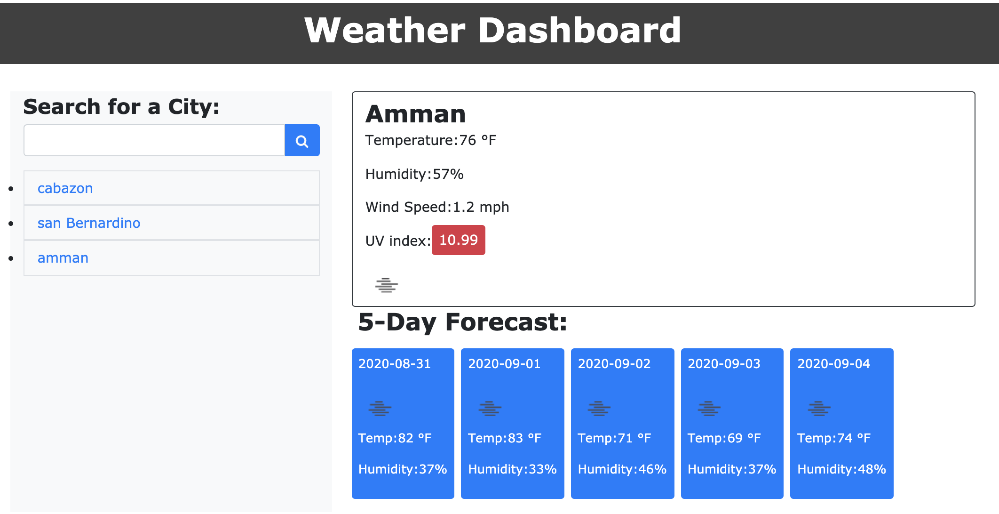

# Weather-Dashboard

A weather dashboard with search functionality to find current weather conditions and the future weather outlook for multiple cities.

Purpose
Build my first app using an API. Retrieve data from a third-party weather API (OpenWeather API) and using it in context.

Functionality
Build a weather dashboard application with search functionality to find current weather conditions and the future weather outlook for multiple cities.

## Getting Started

This project has been deployed to GitHub Pages. To get this project up and running, you can follow the deployment link. Or, download the sources files to use this as a template.
* [GitHub Repository] https://github.com/MahmoudAbdulrhman/Weather-Dashboard

### This project has the following features: 
* A search button
    * This will generet a fetch function to pull information from the weather API ,depends on the city you will looking for it wither.
    * After getting the data we are searching for , the app will display the current weather , also will get some extra data to save them in  a var to use it in uvIndex to get the uv leavel in the city using the uv api.
  * the user will see icone represnt the weather , we got these weather icon using an weather Icon api
* The user will see the temprture for next five days , we got the information using a forecast api.    
* the app will save your input and create button to show the leatest city you searched the temprtur for , these button are functinol so you can click them to retreve the information about the weather again.
  ### Screen shot

